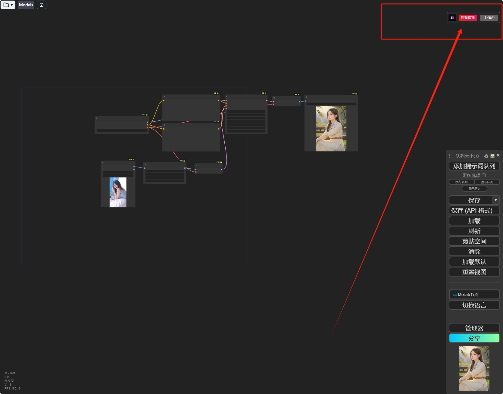
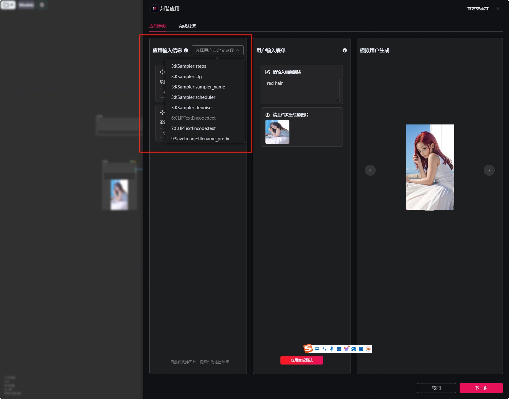
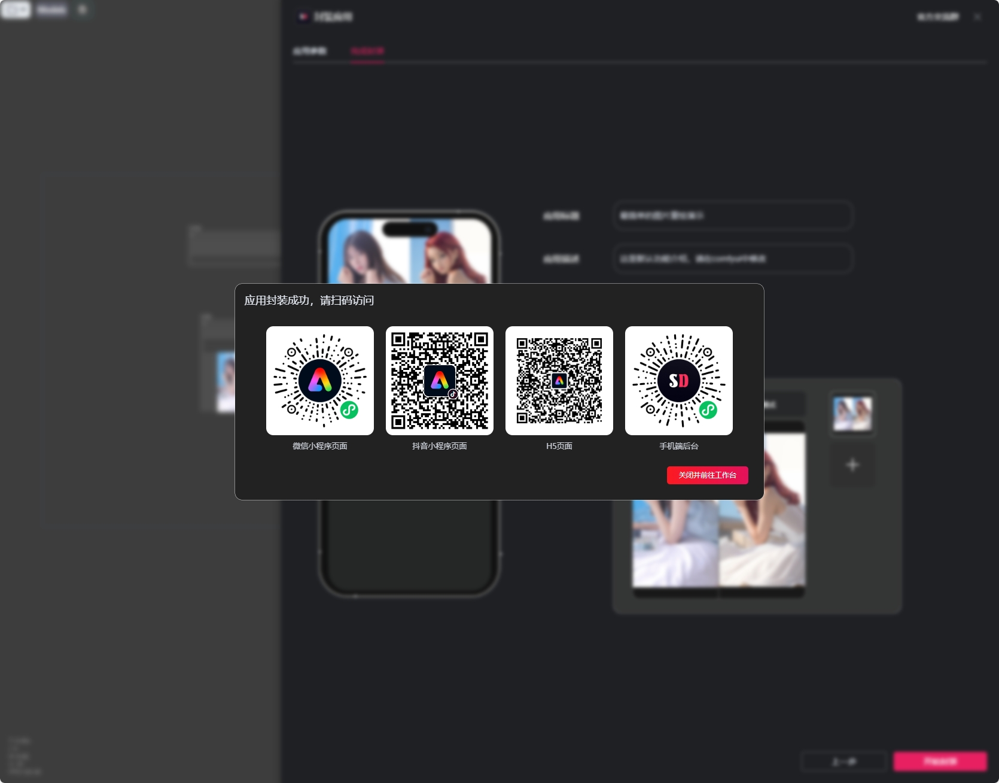
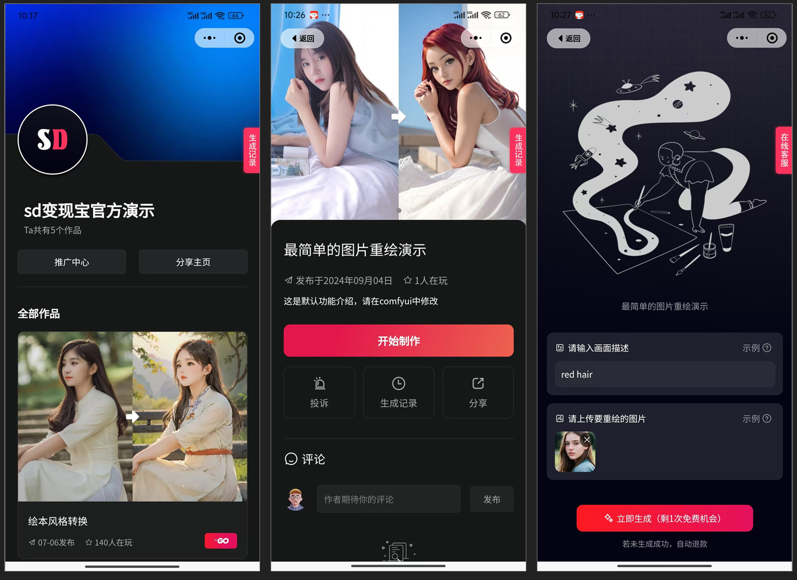
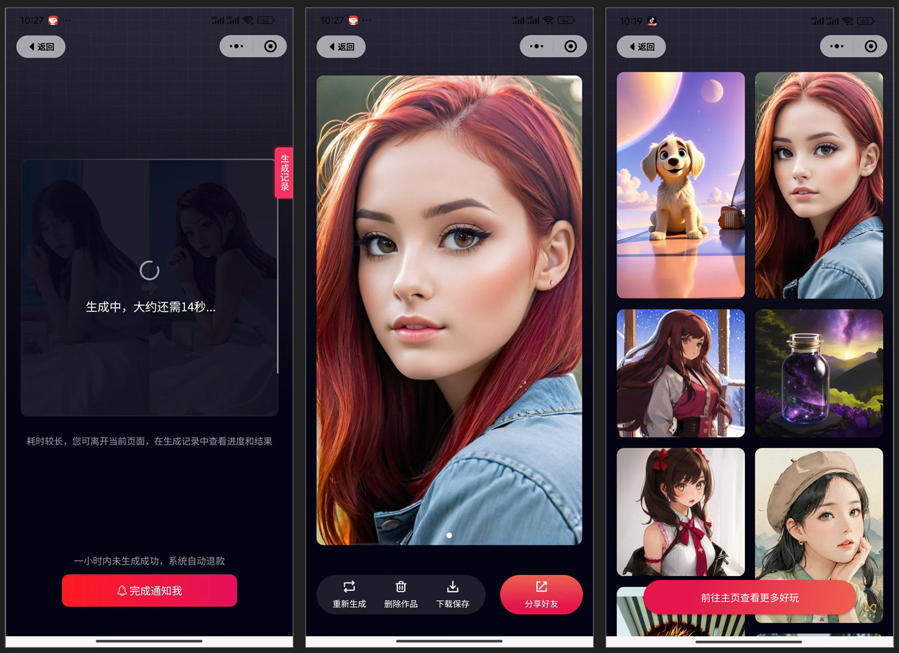
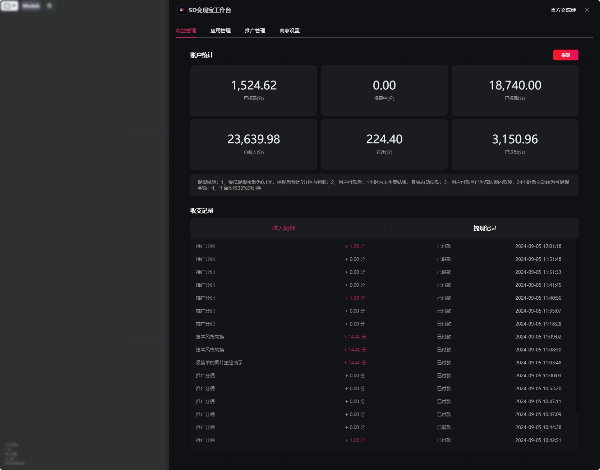
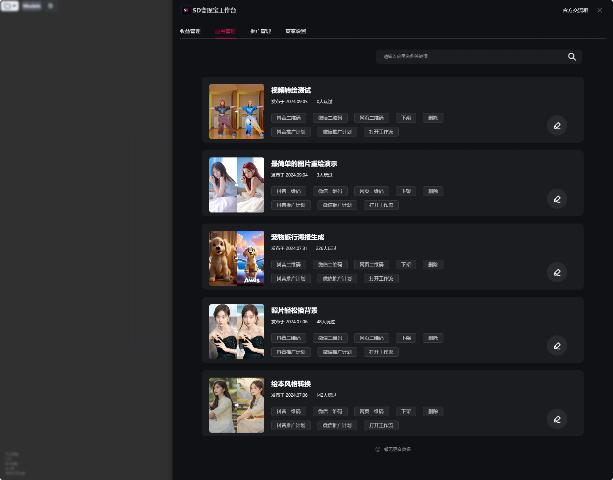
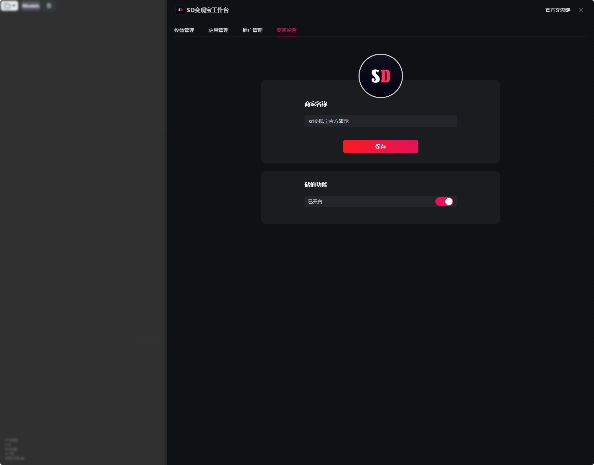

# SD变现宝
## 插件功能
SD变现宝插件可以一键把comfyui工作流转为“微信小程序”、“抖音小程序”、“微信内H5”、“微信外H5”，且都支持支付变现。  
在您现有工作流的基础上，加入ComfyUI_Bxb插件， 即可实现一键转换。
## 特别说明
### 如在使用过程中出现问题，或者您有意见或者建议都请联系我。  
 
## 更新记录 
### 已更新
2024.9.5：  
1、全新pc端后台管理系统；  
2、全新应用封装功能；  
3、支持文本、图片、视频、数字、下拉框五种输入模式；  
4、支持图片、视频输出；   
5、支持多节点输出，比如工作流中包含多个图片保存或者视频保存节点，小程序中也可以正常输出；    
6、放开免费功能，支持作品单价设置为0，支持免费次数设置为几百几千；  
7、主图支持视频展现；  
注意：已经运营的用户，建议晚几天更新或者在一个新comfyui环境中测试，本次更新涉及很多底层逻辑，我们也进行了多轮测试，但是担心还有没测到的兼容问题；另外更新插件后，请刷新浏览器

2024.7.27：  
1、放弃内网穿透，改用全新通信逻辑，从而解决因为防火墙拦截导致的各种网络连接出错问题，360报毒等问题；  
2、增加工作流安全性，杜绝工作流暴露：工作流api数据保存本地电脑，不再上传服务器； 增加专用图片保存节点sdBxb_saveImage（comfyui官方默认的图片保存节点会自动保存工作流信息，sdBxb_saveImage节点不保存工作流信息）；  
3、支持Windows、linux、Mac三个主流系统；  
4、解决sdBxb和部分插件的冲突问题；  
5、优化多电脑并发的逻辑，本地电脑的情况下，只要模型路径信息一致，并把原来ComfyUI_Bxb插件中保存的工作流api数据复制到新电脑上，新电脑开机并打开comfyui终端即可，无需再次点击转换；云端电脑的情况下，直接克隆开机，即可实现多电脑并发；  
6、增加用户作品删除和分享功能；   

2024.7.15：  
1、增加微信作品推广分成功能，支持微信小程序和微信内h5，推广者在作者主页申请推广，作者在个人中心同意推广，那么推广者就可以通过二维码或者链接去推广当前作者的作品了，分成比例作者自由控制；  
  
2024.7.9：  
1、增加抖音小程序推广计划功能；开启并审核通过后，可在抖音APP“小程序推广计划”这个小程序中找到对应作品的推广入口；  
  
2024.7.3：  
1、增加储值功能；  
2、增加免费次数功能；  
3、抖音小程序端支持一次出多图和视频输入输出；  
  
2024.6.28：  
1、支持一次出多图；  
2、支持视频输入和视频输出；  
注意：1、更新后会导致之前的小程序作品无法更新，以后会尽量避免这种情况出现；2、抖音小程序暂时不支持这些功能；微信小程序、微信内h5、微信外h5这三端都支持； 
   
2024.6.23：  
已支持多GPU服务器并发。保存工作流，然后在不同的GPU服务器上点击一键转换，即可实现一个作品对应多个GPU服务器；  
注意：模型路径等信息在不同的GPU服务器上要保持一致
### 计划中   
1、增加供普通用户使用的PC端；  
2、增加看广告获取生图算力的功能；  
## 视频教程
B站：https://www.bilibili.com/video/BV1Bsg8eeEjv  
YouTube：https://youtu.be/5lJn-NHtc9w
## 安装方式
1、通过ComfyUI-Manager在线安装，在ComfyUI-Manager中搜索“ComfyUI_Bxb”即可找到本插件（推荐）；  
2、通过git clone下载插件包，放到ComfyUI/custom_nodes目录下，重启ComfyUI即可安装本插件；  
3、官方QQ群：967073981，下载插件包，放到ComfyUI/custom_nodes目录下，重启ComfyUI即可安装本插件；  
## 使用示例和截屏说明
### ComfyUI插件端截屏
 
 
 
 
 
 
 
 
 
 